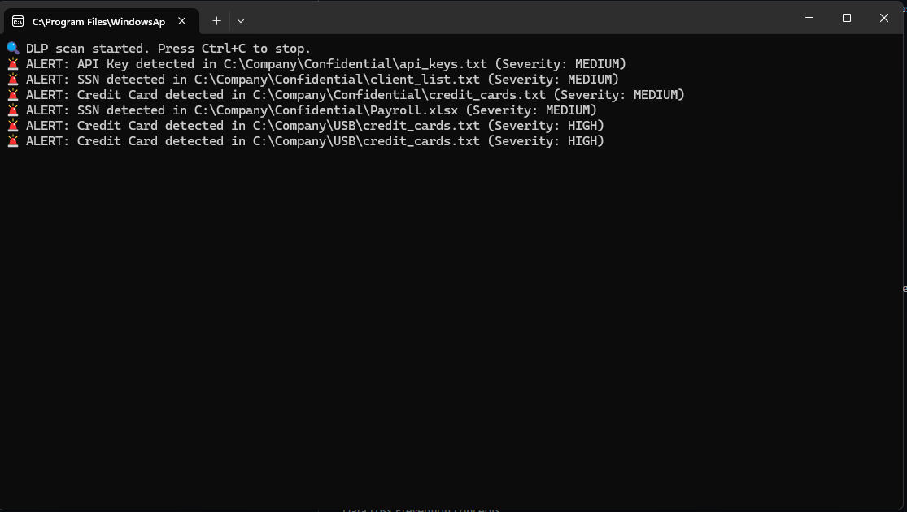

🔐 Python Data Loss Prevention (DLP) Lab
📌 Overview

This project simulates a Data Loss Prevention (DLP) system used by CSIRT teams to detect sensitive data exposure and insider data exfiltration.

🚨 Features

Detects SSNs, credit card numbers, and API keys

Scans text and Excel files for sensitive data

Simulates USB data exfiltration detection

Severity classification (MEDIUM / HIGH)

SHA-256 file integrity tracking

Incident logging for forensic analysis

🧪 Detection Scenario

With this lab im simulating an insider attempting to exfiltrate payroll and client PII via removable media. The system detects and logs the activity.

🛠 Technologies Used

Python

Regex pattern matching

openpyxl (Excel inspection)

File hashing (SHA-256)

🎯 Skills Demonstrated

Data Loss Prevention concepts

Incident detection & logging

Insider threat simulation

Blue Team monitoring techniques

### 🔎 Detection Example

